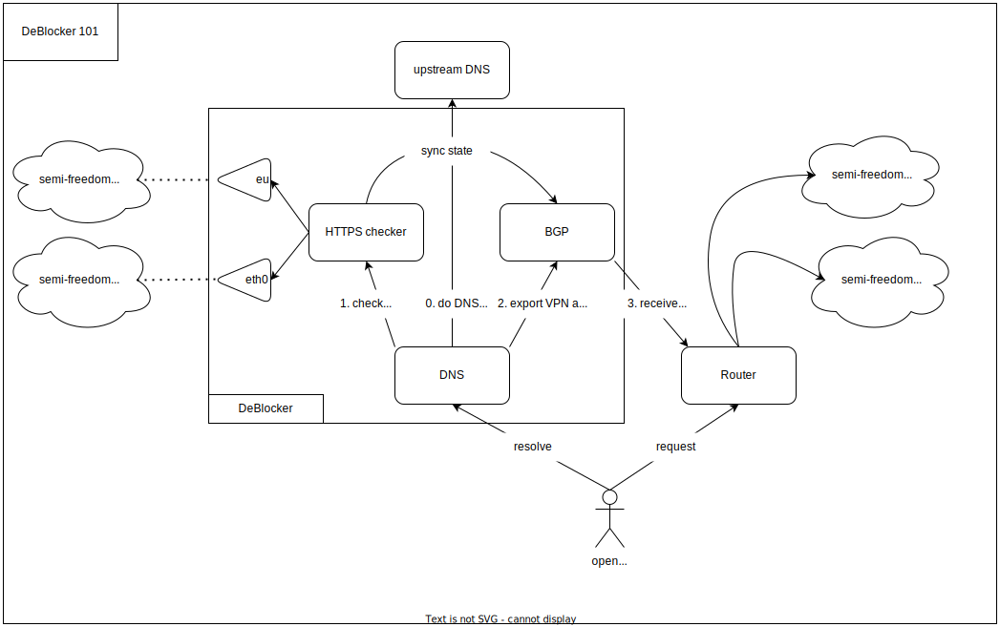

# Intro

Due to mass censorship on the both sides of Russian reality, I want to have some semi/fully automatic solution to bypass them. This is it :)

DeBlocker is a simple and fully automatic service for generating eBGP prefixes of blocked "sites" that you use.

# How it works
A flowchart is worth a thousand words so let's begin from it:

As you can see DeBlocker has a couple of parts:
  - DNS server that:
    * exports A/AAAA answers into BGP if we think that requested _site_ must go over VPN
    * schedules HTTPS site checker to make a decision
  - HTTPS checker just make two HTTP requests - one over VPN interface and one over direct interface. After that, makes decision.
  - BGP server that exports "blocked" prefixes from HTTPS checker or DNS server

So when I execute `curl https://docs.splunk.com`:
  - `curl` resolves `docs.splunk.com` through DeBlocker DNS server that:
    * checks it and must choose the VPN direction
    * adds eBGP path for all the IP addresses that points to `*.splunk.com`
  - and makes a TCP connection that will be routed over VPN
  - that's all, pretty simple

Of course sometimes I need to send request one more time, but this is not annoying me.

# Configuration
The full config can be found [here](./example/config.yaml)

It is assumed that:
  - `eth0` - interface with direct connection
  - `eu` - interface with VPN connection. I prefer WireGuard, but you can use what you need
  - `65543` - DeBlocker ASN
  - `65542` - dynamic neighbor ASN

So, you have to:
  - configure interfaces ;)
  - add the BGP neighbor on your router
  - use DeBlocker DNS at home
  - that's all, folks :)

P.S. 